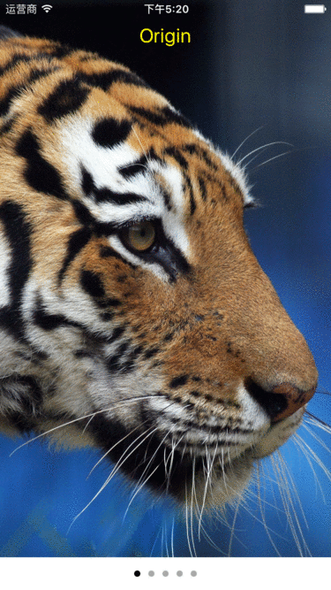

#UIImageEffects
UIImageEffects is a quite lightweight  UIImage extension  for blurring image:




UIImageEffects is based on Apple's UIImage category in sample code [Blurring and Tinting an Image](https://developer.apple.com/library/ios/samplecode/UIImageEffects/Introduction/Intro.html#//apple_ref/doc/uid/DTS40013396).


##How To Get Started

###Usage
##### Light Effect
```swift 
let lightEffectImage = originalImage.applyLightEffect()
```

##### Extra Light Effect
```swift 
let extraLightEffectImage = originalImage.applyExtraLightEffect()
```

##### Dark Effect
```swift 
let darkEffectImage = originalImage.applyDarkEffect()
```

#####Tint Effect
```swift 
let tintColorImage = originalImage.applyTintEffect(tintColor: UIColor.cyanColor())
```

##### Custom
```swift 
let customEffectImage = originalImage.applyBlur(blurRadius: 30, tintColor: UIColor(white: 1, alpha: 0.3), saturationDeltaFactor: 1.5)
```

## Minimum Requirement
iOS 8.0

## Release Notes
* [Release Notes](https://github.com/hongxinhope/UIImageEffects/releases)

## More Info
Have a question? Please [open an issue](https://github.com/hongxinhope/UIImageEffects/issues/new)!